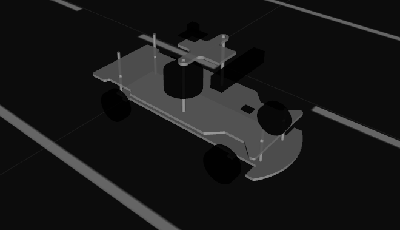
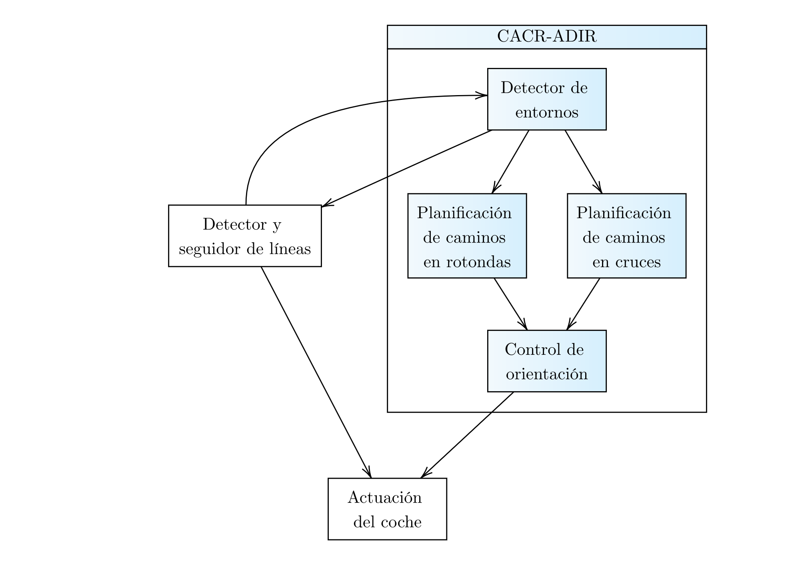
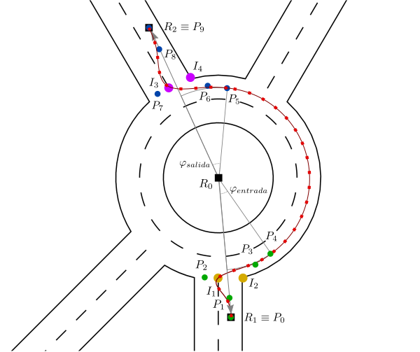
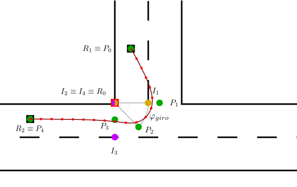
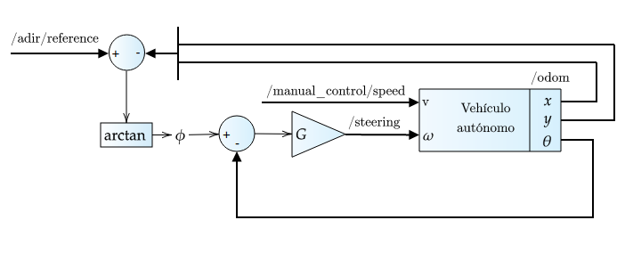

# Circulación autónoma en cruces y rotondas (Autonomous Driving in Intersections and Roundabouts).
Este repositorio contiene el trabajo desarrollado durante mi Trabajo Fin de Grado titulado "Circulación autónoma de un coche a escala 1/10 en cruces y rotondas utilizando ROS y Gazebo" defendido por mí, Germán Ruiz Mudarra en septiembre de 2020 y tutorizado por Jesús Morales Rodríguez y Ricardo Vázquez Martín, profesores del Departamento de Ingeniería de Sistemas y Automática de la Universidad de Málaga.

## Prerequisitos
- Ubuntu 16.04
- [ROS Kinetic](http://wiki.ros.org/kinetic/Installation/Ubuntu)
- [Seat Car Simulator](https://gitlab.iri.upc.edu/mobile_robotics/adc/seat_car_simulator), del Instituto de Robótica e Informática Industrial CSIC-UPC (marzo de 2021: no está disponible ya que pertenecía al Autonomous Driving Challenge 2018 y los organizadores han decidido hacer el repositorio privado)
- FU Line Detector, wiki [aquí](https://github.com/AutoModelCar/AutoModelCarWiki/wiki/FU-line-detection) y paquete de ROS [aquí](https://github.com/AutoModelCar/catkin_ws_user/tree/master/src/fu_line_detection).

     

## Resumen
El detector y seguidor de líneas (DSL) provisto por la competición permitía que el coche se moviera de forma autónoma por su carril, pero no podía superar intersecciones debido a la complejidad de la maniobra. El UMA Garage Team en la edición de 2018 planteó una solución de bucle abierto en las intersecciones en la que el vehículo no tenía realimentación de la trayectoria que estaba realizando. Este trabajo pretende solucionar este problema.

     

Utilizando la información que saca el DSL de la imagen de la cámara frontal y un mapa topológico donde se define la posición de los distintos puntos de interés del circuito (nodos de entrada/salida de las intersecciones), se creó un nodo ROS que su trabajo es distinguir a partir de la información odométrica (comparándolo con un mapa topológico del circuito) y de la curvatura de las líneas detectadas en cuál de los escenarios de circulación posibles está el vehículo (recta, curva, rotonda o cruce). 

En caso de que se esté en una recta o en una curva, el DSL es el encargado de la actuación del coche, funcionando de la misma manera que se planteó anteriormente. 

Sin embargo, si el coche está en una rotonda o en un cruce, el detector activa una planificación específica para cada escenario. Esta planificación es distinta para cada tipo de intersección, estando la de las rotondas basada en [este artículo](https://www.sciencedirect.com/science/article/abs/pii/S0957417416306583) (D. González, J. Perez y V. Milanés, 2016) y la de los cruces en una modificación propia que parte de la técnica anterior. Estos nodos ROS de planificación generan una referencia a partir de curvas de Bézier o SPLINES. [Aquí](https://www.youtube.com/watch?v=pnYccz1Ha34) un ejemplo de cómo funciona este tipo de aproximaciones para ver como se han aplicado a este problema.

    
      

Esta referencia generada va a parar a un nodo ROS que se encarga de hacer un control proporcional de orientación, mandando comandos de dirección al coche.

    

Cubiertos todos estos casos, el coche puede circular por todo el circuito de manera autónoma independientemente del escenario al que se enfrente y con un método que garantiza que las maniobras en las intersecciónes se realizan correctamente.

## Mejoras propuestas
- Utilizar métodos alternativos de odometría para mejorar la precisión, como odometría visual.
- Utilizar algoritmos de inteligencia artificial para que el detector de entornos pueda funcionar únicamente con la cámara.
- Añadir a este proyecto un sistema de planificación de caminos como Dijsktra o A*, ya que la toma de decisiones cuando se encuentra en una intersección no es autónoma.
